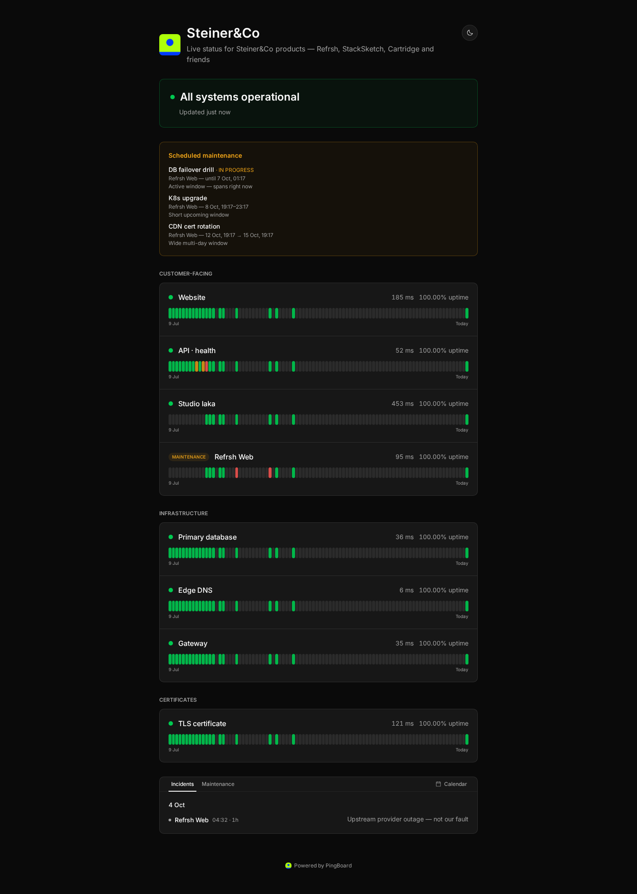
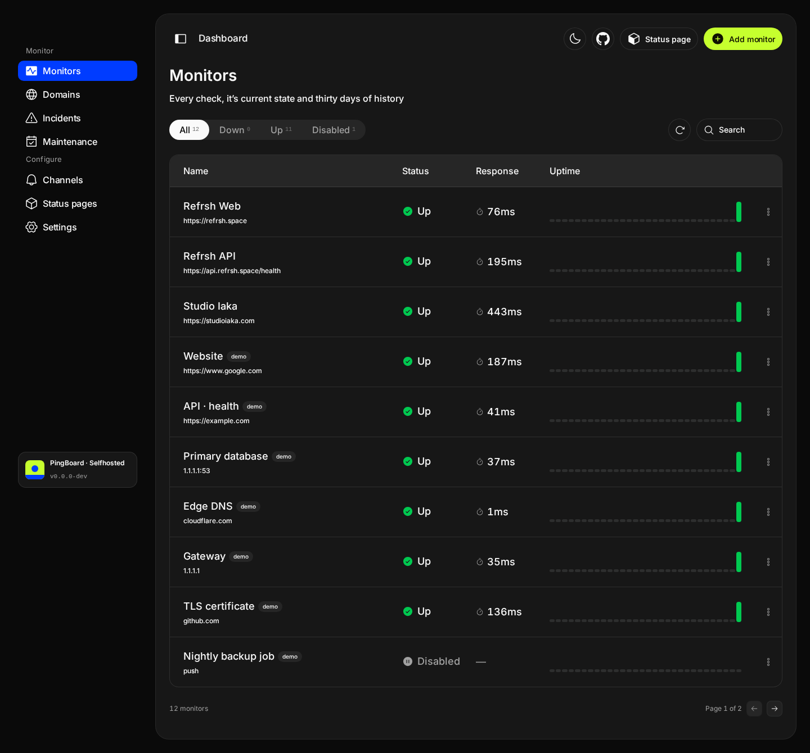
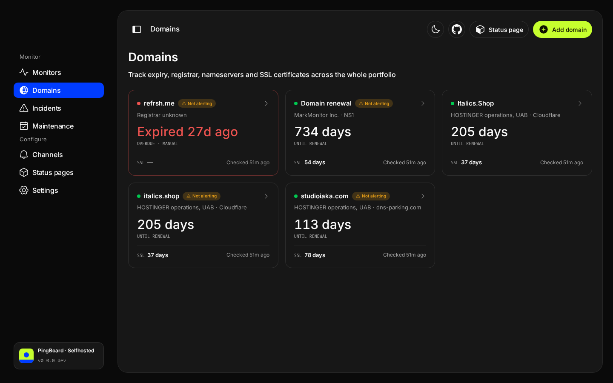
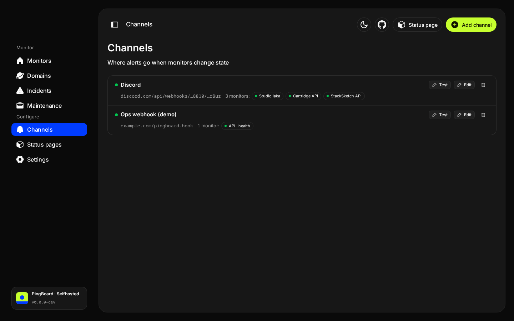
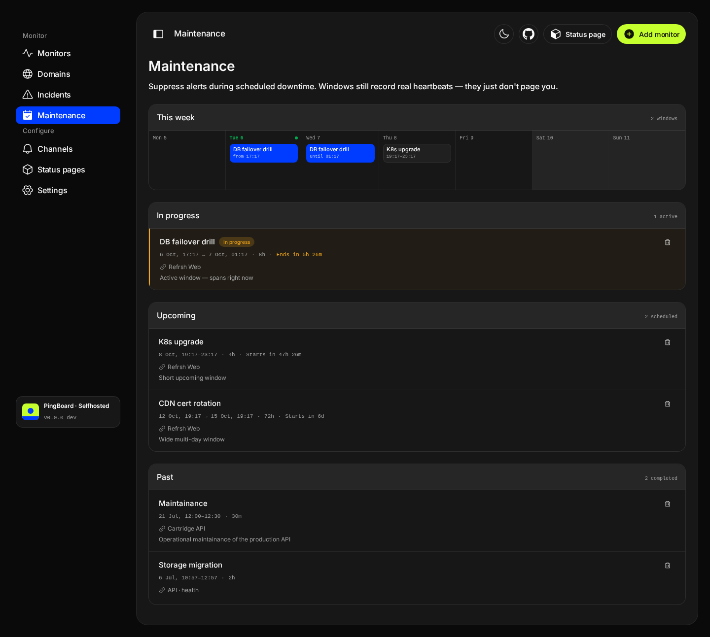

# PingBoard

> Dead-simple, self-hosted uptime monitoring with built-in status pages. One container, one volume, one port.

<picture>
  <source media="(prefers-color-scheme: dark)" srcset=".github/assets/status-page-dark.png">
  <source media="(prefers-color-scheme: light)" srcset=".github/assets/status-page-light.png">
  
</picture>

## Quickstart

With Docker Compose — no clone needed, just grab the compose file:

```bash
curl -O https://raw.githubusercontent.com/Steiner-Co/PingBoard/main/compose.yaml
docker compose up -d
```

Or with `docker run`:

```bash
docker run -d --restart=always \
  -p 3000:3000 \
  -v pingboard:/data \
  --name pingboard \
  ghcr.io/steiner-co/pingboard:latest
```

Open `http://localhost:3000`, create your admin account, add your first monitor. Done in under a minute.

## What it does

- **7 monitor types** — HTTP(S), TCP, ping, DNS, SSL-certificate expiry, domain expiry, and push/heartbeat, plus keyword/JSON assertions on HTTP bodies
- **5 notification channels** — email (SMTP), webhook, Discord, Slack, ntfy
- **Public status pages** — multiple per instance, optional password protection, custom slugs
- **Free branding** — logo, theme presets, website link, custom CSS, and a white-label toggle on every status page. Others charge per page for this; PingBoard doesn't
- **Live dashboard** — real-time updates via SSE, no polling
- **Maintenance windows** — schedule downtime; alerts stay quiet, the status page says why
- **API tokens** — drive everything from scripts, not just the browser
- **MCP server** — query and control your monitors from Claude, Cursor or any MCP client
- **Single binary feel** — one container, one SQLite file under `/data`, no Redis, no queue

## Inside the admin

<table>
  <tr>
    <td>
      <picture>
        <source media="(prefers-color-scheme: dark)" srcset=".github/assets/dashboard-dark.png">
        <source media="(prefers-color-scheme: light)" srcset=".github/assets/dashboard-light.png">
        
      </picture>
    </td>
    <td>
      <picture>
        <source media="(prefers-color-scheme: dark)" srcset=".github/assets/domains-dark.png">
        <source media="(prefers-color-scheme: light)" srcset=".github/assets/domains-light.png">
        
      </picture>
    </td>
  </tr>
  <tr>
    <td>
      <picture>
        <source media="(prefers-color-scheme: dark)" srcset=".github/assets/channels-dark.png">
        <source media="(prefers-color-scheme: light)" srcset=".github/assets/channels-light.png">
        
      </picture>
    </td>
    <td>
      <picture>
        <source media="(prefers-color-scheme: dark)" srcset=".github/assets/maintenance-dark.png">
        <source media="(prefers-color-scheme: light)" srcset=".github/assets/maintenance-light.png">
        
      </picture>
    </td>
  </tr>
</table>

## Configuration

All optional — no env vars are required to boot.

| Variable | Default | What it does |
|---|---|---|
| `PORT` | `3000` | HTTP port |
| `DATA_DIR` | `/data` | SQLite database location |
| `PINGBOARD_BASE_URL` | (auto) | Used in alert links — set to your public URL when behind a reverse proxy |
| `PINGBOARD_TRUST_PROXY` | `off` | Set to `true` behind a reverse proxy so rate limiting keys on `X-Forwarded-For` |
| `PINGBOARD_PUBLIC_RATE_LIMIT` | `60` | Public API requests per minute per client IP |
| `PINGBOARD_UPDATE_CHECK` | (on) | Set to `off` to disable the daily check for new releases |
| `LOG_LEVEL` | `info` | `debug` / `info` / `warn` / `error` |

## Status page branding

Every status page can be branded from **Status pages → Edit** — the page itself is the canvas, rendered live as you make changes:

- **Logo** — PNG/JPEG/SVG/WebP up to 512 KB, stored under `/data/assets`
- **Theme presets** — nine prebuilt palettes (Catppuccin, Nord, Gruvbox, Tokyo Night, Rosé Pine, GitHub, Kanagawa, Synthwave, Noir) that hold contrast in both light and dark, written into Custom CSS where you can tweak them
- **Website URL** — the logo and title link back to your site
- **Custom CSS** — injected into that page only (≤ 10 KB)
- **White label** — hide the "Powered by PingBoard" footer, free

## Reverse proxy

PingBoard does not handle TLS itself. Put it behind Caddy / nginx / Traefik with a normal HTTP-to-app proxy.

Example Caddyfile:

```
status.example.com {
  reverse_proxy pingboard:3000
}
```

## Backups

Stop the container, copy `/data/pingboard.db` (and `pingboard.db-wal` if present), restart.

```bash
docker stop pingboard
cp -r /var/lib/docker/volumes/pingboard /backups/pingboard-$(date +%F)
docker start pingboard
```

## API

Create a token under **Settings → API tokens**. It's shown once, so store it
when you create it — there's no way to read it back.

```bash
curl -H "Authorization: Bearer pb_..." http://localhost:3000/api/admin/monitors
```

A token has the same access as the admin account. Everything the dashboard
does is available: `/api/admin/monitors`, `/api/admin/incidents`,
`/api/admin/channels`, `/api/admin/pages`, `/api/admin/maintenance-windows`.
Revoke a token from the same screen; it stops working immediately.

## MCP

Ask your assistant what's down, or have it schedule maintenance for you:

```bash
claude mcp add pingboard \
  --env PINGBOARD_URL=http://localhost:3000 \
  --env PINGBOARD_TOKEN=pb_... \
  -- npx -y @pingboard/mcp
```

Works with Claude Code, Claude Desktop, Cursor and Zed. See
[`apps/mcp`](./apps/mcp) for the tool list and other client configs.

## CLI

```bash
# Reset the admin password (e.g. if forgotten)
docker exec pingboard pingboard reset-password admin@example.com
```

## Development

Requires [Bun](https://bun.sh) >= 1.3.

```bash
bun install
bun run typecheck
bun test

# Backend at :3000, frontend at :5173 (proxied)
cd apps/pingboard && bun run dev
# in another terminal:
cd packages/ui && bun run dev
```

### Releasing

Every push to `main` runs CI (typecheck, test, build) but publishes nothing.
A release happens only when you push a version tag:

```bash
git tag v1.2.0
git push origin v1.2.0
```

That triggers the release workflow, which builds the multi-arch Docker image,
pushes it to `ghcr.io/steiner-co/pingboard` (tagged `1.2.0`, `1.2`, `1`, and
`latest`), stamps the app's version from the tag, and creates a GitHub Release
with notes generated from the commits since the previous tag.

> First release only: GHCR packages start **private**. Make the package public
> once (repo → Packages → package settings) so `docker pull` works for everyone.

## Architecture

- **Runtime:** Bun (`Bun.serve` + `bun:sqlite`)
- **DB:** SQLite via Drizzle ORM (single `pingboard.db` file)
- **Realtime:** Server-Sent Events
- **Frontend:** React 18 + Vite + Tailwind + ShadCN
- **Scheduler:** in-process `setTimeout` loops — no Redis, no queue
- **Repo:** Turborepo monorepo, MIT licensed

See [`PRD.md`](./PRD.md) for the full product spec and roadmap.

## Roadmap

Shipped in v1.0:
- ✅ Core monitor types, channels, status pages, dashboard, public pages
- ✅ SSL certificate and domain expiry monitoring
- ✅ Push/heartbeat monitors
- ✅ Maintenance windows
- ✅ API tokens for programmatic access
- ✅ MCP server
- ✅ Full product redesign — admin, status pages, auth, landing

Future (cloud):
- Multi-region probing
- Workspaces and billing (open-source code, hosted operationally)

## License

[MIT](./LICENSE)

## Third-party assets

Icons by the [Phosphor](https://phosphoricons.com) icon set, licensed under
[MIT](https://github.com/phosphor-icons/phosphor-icons/blob/master/LICENSE).
